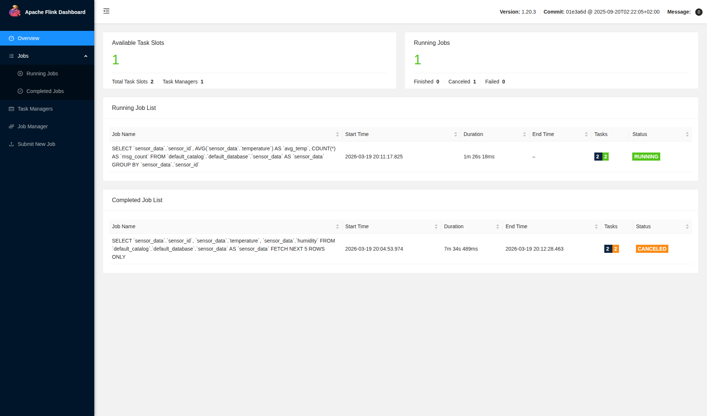
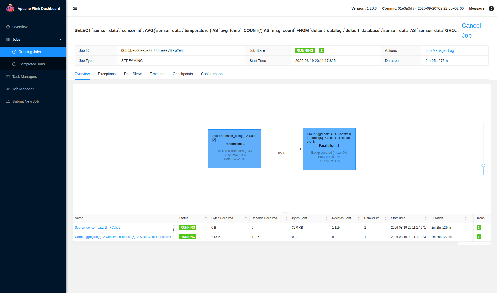

# Flink + Iggy Quickstart

A working example for the [flink-connector-iggy](https://github.com/gordonmurray/flink-connector-iggy) - a custom Apache Flink connector that enables Flink to read directly from [Apache Iggy](https://iggy.apache.org) streams using the Flink SQL API.

This quickstart spins up a complete stack so you can see the connector in action: a Python producer writes synthetic sensor data to Iggy, and Flink reads it back using Flink SQL via the connector.

---

## What's Inside

- **Iggy**: High-performance, Rust-native message broker.
- **Apache Flink**: Scalable stream processing engine.
- **Mock Producer**: A Python service emitting synthetic sensor data to Iggy.
- **SQL Client**: Pre-configured to query Iggy data using Flink SQL.

---

## Quick Start

### 1. Start the Stack
```bash
docker compose up -d
```

### 2. Open the Flink SQL Client
```bash
docker exec -it flink-sql-client /opt/flink/bin/sql-client.sh
```

### 3. Run the Example
Copy and paste the following into your SQL terminal:

```sql
-- Load the connector JAR
SET 'pipeline.jars' = 'file:///opt/flink/lib/flink-connector-iggy.jar';

-- Define the Iggy table
CREATE TABLE sensor_data (
  sensor_id   STRING,
  temperature DOUBLE,
  humidity    DOUBLE,
  `timestamp` STRING,
  ts AS TO_TIMESTAMP(REPLACE(`timestamp`, 'Z', '')),
  WATERMARK FOR ts AS ts - INTERVAL '5' SECOND
) WITH (
  'connector' = 'iggy',
  'host'      = 'iggy',
  'stream'    = 'quickstart',
  'topic'     = 'sensors',
  'format'    = 'json'
);

-- Watch the data stream in
SELECT
  sensor_id,
  AVG(temperature) as avg_temp,
  COUNT(*) as msg_count
FROM sensor_data
GROUP BY sensor_id;
```

---

## Screenshots

### Flink Dashboard

The Flink Web UI at `http://localhost:8081` shows the streaming job running:



### Job Graph

Clicking into the running job shows the execution graph — the Iggy source reading sensor data into the GroupAggregate operator:



---

## Repository Structure

- `producer/`: Python source and Dockerfile for the mock data generator.
- `flink/sql/`: Initialization SQL scripts.
- `libs/`: Contains the `flink-connector-iggy.jar`.
- `docker-compose.yml`: Orchestrates the entire stack.

---

## Resources

- [Iggy.rs Documentation](https://iggy.rs)
- [Apache Flink Documentation](https://flink.apache.org)
- [flink-connector-iggy Repository](https://github.com/gordonmurray/flink-connector-iggy)
